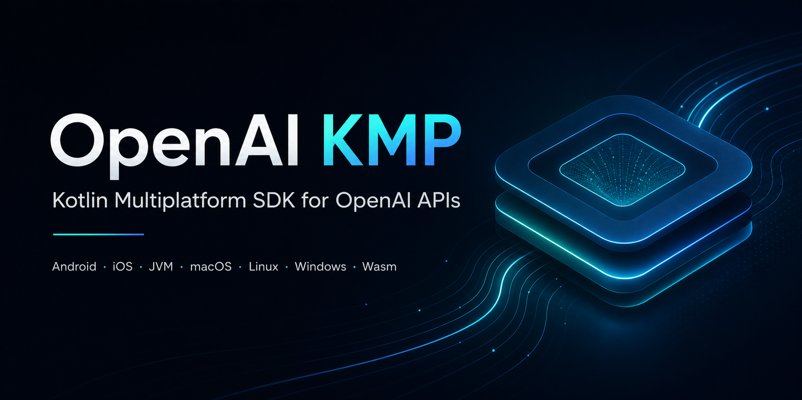

# OpenAI KMP

<p align="center">
  
</p>

Kotlin Multiplatform SDK for OpenAI APIs.

## Why This SDK

- Same modular style as `supabase-kmp`, adapted for OpenAI APIs.
- Shared transport and configuration across all domains.
- Raw and typed API access patterns for stable and fast-evolving payloads.
- Multiplatform-first targets with one consistent client surface.

## Module Map

| Module | Purpose | Endpoint Families |
|---|---|---|
| `openai-core` | shared error/list contracts and common helpers | shared |
| `openai-client` | HTTP transport, config, JSON/multipart plumbing | shared |
| `openai-responses` | Responses API | `/responses` |
| `openai-chat` | Chat Completions API | `/chat/completions` |
| `openai-embeddings` | Embeddings API | `/embeddings` |
| `openai-files` | File upload/list/delete/content | `/files` |
| `openai-batches` | Batch job lifecycle | `/batches` |
| `openai-models` | Model list/retrieve/delete | `/models` |
| `openai-moderations` | Moderation checks | `/moderations` |
| `openai-images` | Generate/edit/variation image workflows | `/images` |
| `openai-audio` | Speech/transcription/translation | `/audio` |
| `openai-finetuning` | Fine-tuning jobs/events/checkpoints | `/fine_tuning` |
| `openai-vectorstores` | Vector store and vector file operations | `/vector_stores` |
| `openai-uploads` | multipart upload session lifecycle | `/uploads` |

## Targets

- Android
- JVM
- iOS (x64/arm64/simulator arm64)
- macOS (x64/arm64)
- tvOS (x64/arm64/simulator arm64)
- watchOS (x64/arm64/simulator arm64)
- Linux x64
- Windows mingw x64
- WasmJs

## Setup

### Version Catalog

```kotlin
[versions]
openai-kmp = "0.0.1"

[libraries]
openai-client = { module = "io.github.androidpoet:openai-client", version.ref = "openai-kmp" }
openai-responses = { module = "io.github.androidpoet:openai-responses", version.ref = "openai-kmp" }
openai-files = { module = "io.github.androidpoet:openai-files", version.ref = "openai-kmp" }
```

### Module Dependencies

```kotlin
kotlin {
    sourceSets {
        commonMain.dependencies {
            implementation(libs.openai.client)
            implementation(libs.openai.responses)
            implementation(libs.openai.files)
        }
    }
}
```

## Client Creation

```kotlin
val client = OpenAI.create(
    apiKey = System.getenv("OPENAI_API_KEY"),
) {
    logging = true
    timeoutMillis = 60_000
    organization = null
    project = null
}
```

## Quick Start (Responses)

```kotlin
val responses = client.responses()
val responseOutcome = responses.createTyped(
    request = ResponseCreateRequest(
        model = "gpt-4.1-mini",
        input = buildJsonArray {
            addJsonObject {
                put("role", "user")
                put("content", buildJsonArray {
                    addJsonObject {
                        put("type", "input_text")
                        put("text", "Say hello from openai-kmp")
                    }
                })
            }
        },
    ),
)
```

## Core Usage by Domain

### Chat Completions

```kotlin
val chat = client.chat()
val completionOutcome = chat.createTyped(
    ChatCompletionRequest(
        model = "gpt-4.1-mini",
        messages = messagesJson,
    ),
)
```

### Embeddings

```kotlin
val embeddings = client.embeddings()
val embeddingOutcome = embeddings.createTyped(
    EmbeddingRequest(
        model = "text-embedding-3-small",
        input = embeddingInputJson,
    ),
)
```

### Files

```kotlin
val files = client.files()
val fileUploadOutcome = files.create(
    purpose = "assistants",
    bytes = fileBytes,
    filename = "knowledge.pdf",
    contentType = "application/pdf",
)
```

### Images

```kotlin
val images = client.images()
val imageOutcome = images.generateTyped(
    ImageGenerationRequest(
        model = "gpt-image-1",
        prompt = "A cinematic landscape at sunset",
        size = "1024x1024",
    ),
)
```

### Audio Transcription

```kotlin
val audio = client.audio()
val transcriptOutcome = audio.transcriptionTyped(
    audioBytes = wavBytes,
    audioFilename = "meeting.wav",
    model = "gpt-4o-mini-transcribe",
)
```

### Fine-Tuning

```kotlin
val fineTuning = client.fineTuning()
val jobOutcome = fineTuning.createJobTyped(
    FineTuningJobCreateRequest(
        model = "gpt-4.1-mini",
        trainingFile = "file_abc123",
    ),
)
```

### Vector Stores

```kotlin
val vectorStores = client.vectorStores()
val storeOutcome = vectorStores.createTyped(
    VectorStoreCreateRequest(
        name = "docs-index",
    ),
)
```

### Upload Sessions

```kotlin
val uploads = client.uploads()
val uploadOutcome = uploads.createTyped(
    UploadCreateRequest(
        purpose = "assistants",
        filename = "archive.zip",
        bytesCount = zipSize,
        mimeType = "application/zip",
    ),
)
```

## Handling Outcomes

```kotlin
val modelOutcome = client.models().retrieveTyped("gpt-4.1-mini")

modelOutcome
    .onSuccess { model ->
        println("model=${model.id}")
    }
    .onFailure { error ->
        println("status=${error.statusCode} message=${error.message}")
    }
```

Additional helpers:
- `map`, `flatMap`
- `recover`, `getOrElse`
- `getOrNull`, `getOrThrow`, `errorOrNull`

## Configuration Surface

`OpenAI.create` supports:
- `logging: Boolean`
- `logLevel: LogLevel`
- `organization: String?`
- `project: String?`
- `timeoutMillis: Long`
- `headers: MutableMap<String, String>`

Example:

```kotlin
val client = OpenAI.create(apiKey = token) {
    logging = true
    logLevel = LogLevel.HEADERS
    timeoutMillis = 90_000
    headers["X-App-Name"] = "my-kmp-app"
}
```

## Recommended Integration Pattern

1. Create one long-lived `OpenAIClient` instance.
2. Expose feature clients from your DI container.
3. Keep endpoint request building in domain/services layer.
4. Centralize retry/backoff policy in one place.
5. Close the client on app shutdown.

## File and Vector Workflow (Typical)

1. Upload document using `files.create(...)`.
2. Create vector store using `vectorStores.createTyped(...)`.
3. Attach file to store using `vectorStores.addFile(...)`.
4. Query store using `vectorStores.searchTyped(...)`.

## Batches Workflow (Typical)

1. Upload JSONL requests file.
2. Create batch with `batches.createTyped(...)`.
3. Poll status with `batches.retrieveTyped(...)`.
4. Fetch output/error files after completion.

## Project Docs

Full docs live under [`docs/`](/Users/ranbirsingh/openai-kmp/docs/README.md):

- [Module Overview](/Users/ranbirsingh/openai-kmp/docs/reference/module-overview.md)
- [Architecture Deep Dive](/Users/ranbirsingh/openai-kmp/docs/reference/architecture-deep-dive.md)
- [Module API Reference](/Users/ranbirsingh/openai-kmp/docs/reference/module-api-reference.md)
- [Configuration Reference](/Users/ranbirsingh/openai-kmp/docs/reference/configuration-reference.md)
- [API Usage Guide](/Users/ranbirsingh/openai-kmp/docs/reference/api-usage-guide.md)
- [Integration Patterns](/Users/ranbirsingh/openai-kmp/docs/reference/integration-patterns.md)
- [Migration Guide](/Users/ranbirsingh/openai-kmp/docs/reference/migration-guide.md)
- [Error Handling](/Users/ranbirsingh/openai-kmp/docs/reference/error-handling.md)
- [Platform Engine Matrix](/Users/ranbirsingh/openai-kmp/docs/reference/platform-engine-matrix.md)

## Status

- Multiplatform compile: green
- JVM tests: green
